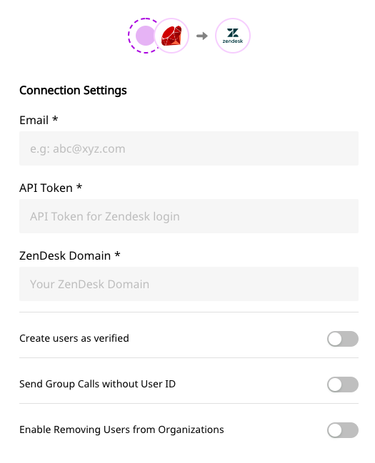

# Zendesk

[Zendesk](https://www.zendesk.com/) is a popular CRM and customer support service suite that ensures cutting-edge sales and support across various business domains. It allows you to tend to your customers in the best way possible, and satisfactorily resolve all their queries and concerns. Zendesk also offers features such as live chat, call center software capabilities, and a smart knowledge base so that your executives have a handy solution to any customer query at hand.

RudderStack supports integration with Zendesk and allows you to send your customer data to Zendesk seamlessly.

This document lays out the steps to follow for sending your event data to Zendesk.

<div class="successBlock">
  <strong>
    Find the open-source transformer code for this destination in our{" "}
    <a href="https://github.com/rudderlabs/rudder-transformer/tree/master/v0/destinations/zendesk">
      GitHub repo
    </a>
    .
  </strong>
</div>

## Getting Started

As a first step, you need to add Zendesk as a destination to the source on the dashboard. Once the destination is enabled, your event data will start flowing to Zendesk.

Before configuring your source and destination on RudderStack, please verify if the Zendesk destination supports the source platform. Refer to the table below:

| **Connection Mode** | **Web**       | **Mobile**    | **Server**    |
| :------------------ | :------------ | :------------ | :------------ |
| **Device mode**     | -             | -             | -             |
| **Cloud mode**      | **Supported** | **Supported** | **Supported** |

<div class="infoBlock">
To know more about the difference between Cloud mode and Device mode in RudderStack, read the <a href="../../get-started/rudderstack-connection-modes">RudderStack connection modes</a> guide.

</div>

Once you have verified that the platform supports forwarding events to Zendesk, perform the steps below:

- From your [RudderStack dashboard](https://app.rudderlabs.com/), add the source. From the list of destinations, select Zendesk.

<div class="infoBlock">
Please follow our guide on <a href="../connections/adding-source-and-destination-rudderstack">How to Add a Source and Destination in RudderStack</a> to add a source and destination in RudderStack.

</div>

- Give a name to the destination for your future reference to this destination and click on **Next**. The following screenshot shows the screen you expect.



- Enter your Zendesk email and API token
- Click on **Next** to finish the configuration. Zendesk should now be added and enabled as a destination in RudderStack.

## Identify

The `identify` call creates or updates a user in Zendesk. We use the `email` in `traits` for those actions. Thus, we recommend you to send the email address of your user in the identify call.

```javascript
rudderanalytics.identify("12345678", {
  name: "John Wick",
  email: "johnwick@example.com",
  country: "UK",
})
```

Currently, RudderStack maps to a subset of the standard user attributes of a Zendesk user. We create a new custom field for the unmapped attributes.

The current mapping is as follows:

| RudderStack      | Zendesk           |
| :--------------- | :---------------- |
| `email`          | `email`           |
| `name`           | `name`            |
| `organizationId` | `organization_id` |
| `timezone`       | `time_zone`       |
| `phone`          | `phone`           |
| `userId`         | `user_id`         |
| `userId`         | `external_id`     |

<div class="infoBlock">
The `organization_id` is Zendesk organization id and they create it.

</div>

### Verifying Users at Creation

You can use the dashboard setting "**Create users as verified**" to register the users as verified during creation. Zendesk skips the email verification step for those users.

### Removing User from an Organization Membership in Identify

Please enable the option in our dashboard - **Enable Removing Users from Organizations** to access this feature. The following fields are mandatory in the payload under `context.traits` for this action:

- `company.id`
- `company.remove` \(to be set as `true`\)

We assume a valid Zendesk `organization_id` in the `company.id` field. Then we find the organization corresponding to that `id`, and perform the action. A sample `identify` call for this should look like the below:

```javascript
rudderanalytics.identify("12345678", {
  name: "John Wick",
  email: "johnwick@example.com",
  country: "UK",
  company: {
    id: 900001329943,
    remove: true,
  },
})
```

This `identify` call updates the user as well as remove it from the organization with id `900001329943`

## Track

Zendesk expects an `userId` for every `track` call. You can set the `userId` by producing an `identify` call before sending any `track` event. We affix the user details from the `identify` call, to the subsequent calls.

Here is a sample `track` call

```javascript
rudderanalytics.track("Track me", {
  category: "category",
  label: "label",
  value: "value",
})
```

<div class="infoBlock">
  **IMPORTANT:** We use [Zendesk Sunshine Events
  API](https://developer.zendesk.com/rest_api/docs/sunshine/events_api) for
  `track` call. You need to meet the following criteria to make the `track`
  events successful.
  <ul>
    <li>You've signed up for the Events API early access program</li>
    <li>A `userId` is passed along with the `track` call</li>
  </ul>
</div>

## Group

You can use the `group` call to create or update an organization in Zendesk. We use the `groupId` to do that.

Here is a sample `group` call

```text
rudderanalytics.group("123456789", {
  name: "Softworks",
  country: "UK",
  group_plan: "trial",
});
```

The group call connects the user to the organization.‌ You can incapacitate this feature by disabling the "**Send Group Calls without User ID"** on the dashboard. We create or update the organization if no user is associated with the event.

Currently, RudderStack maps the group traits to a subset of the standard organization attributes of Zendesk. We'll create a new custom field for any unmapped attributes.

The current mapping is as follows:

| RudderStack   | Zendesk        |
| :------------ | :------------- |
| `name`        | `name`         |
| `domainNames` | `domain_names` |
| `tags`        | `tags`         |
| `groupId`     | `external_id`  |
| `url`         | `url`          |
| `deleted`     | `deleted`      |

We assume that there is always an `identify` call before any `group` call with userId is made. If `groupId` and `userId` both are present in the payload of a group call, then, we will find the user with the **email** present in the traits, if not present, we will create the user. We also find the organization by the `groupId` that you provide. If that is not present, we create that too and after that, we do the association.

If the user exists the `organizationId` will be attached to the user and all the user information will be sent for this call. The `traits` under `message` containts the group information but when the `identify` call is being made during the `group` call the user informations will be fetched from the `context.traits`.

## Settings

The following are the settings for Zendesk:

### Email

The email you use to log in to Zendesk.

### API Token

This is the API token that will be used to authenticate the request. If you do not have an API token created, follow [creating an API token in Zendesk](https://support.zendesk.com/hc/en-us/articles/226022787-Generating-a-new-API-token-).

### Zendesk Domain

This is your Zendesk subdomain \(not including `.zendesk.com`\)

### Create users as verified

Enabling this setting will create users as verified\(skipping the email verification\). We will send `verified` as true if this setting is enabled

### Send Group Calls without a User ID

Enable this setting if you don't want to associate the user with the group. If this setting is enabled, only the group will be created or updated if `userId` is not present in the payload.

## Contact Us

If you come across any issues while configuring Zendesk with RudderStack, please feel free to [contact us](mailto:%20docs@rudderstack.com). You can also start a conversation on our [Slack](https://resources.rudderstack.com/join-rudderstack-slack) channel; we will be happy to talk to you!
