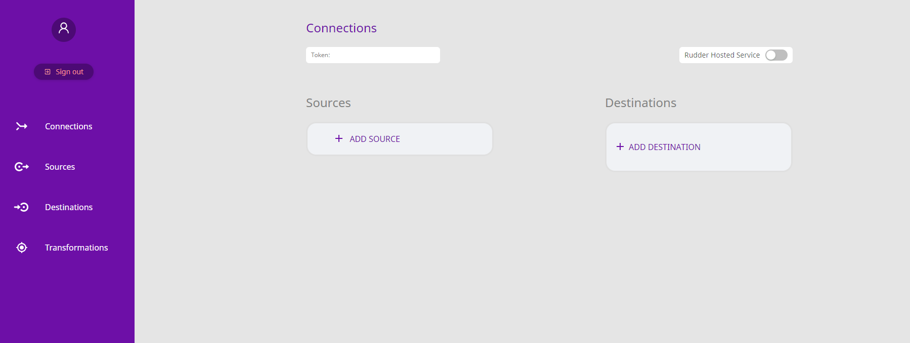
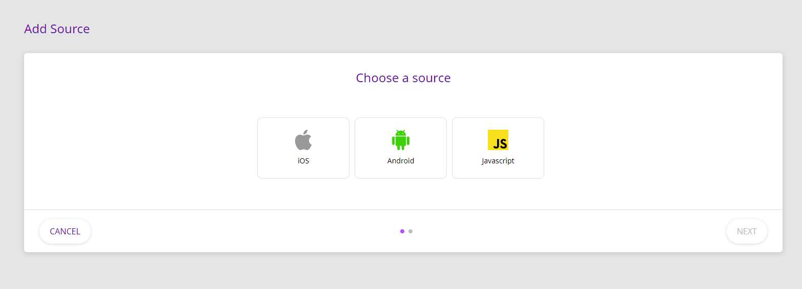
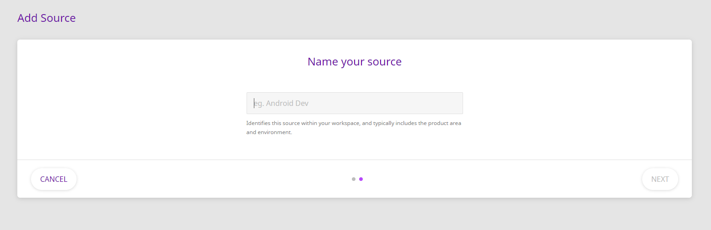
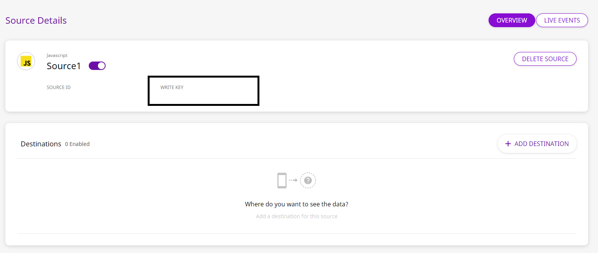
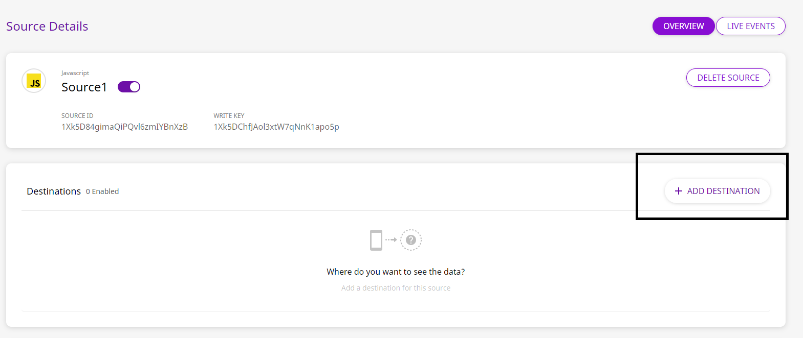
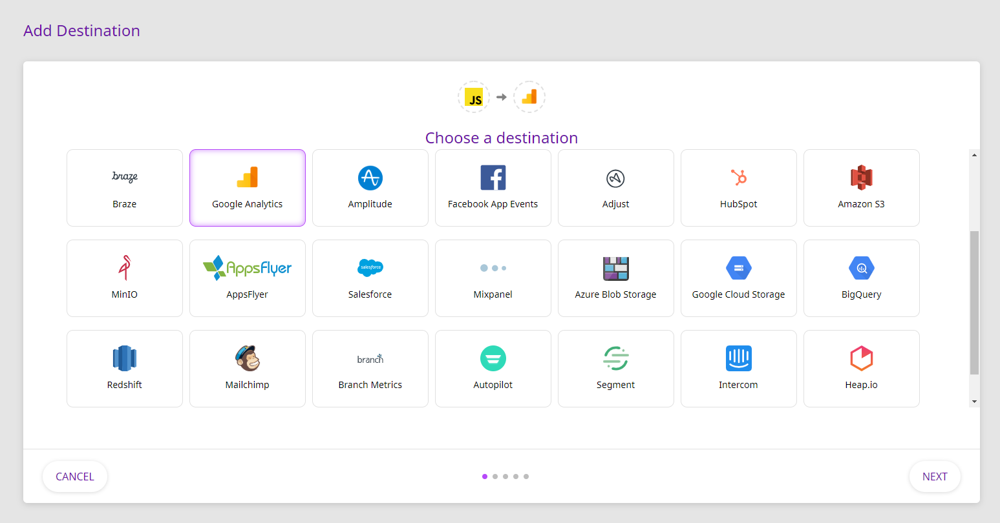
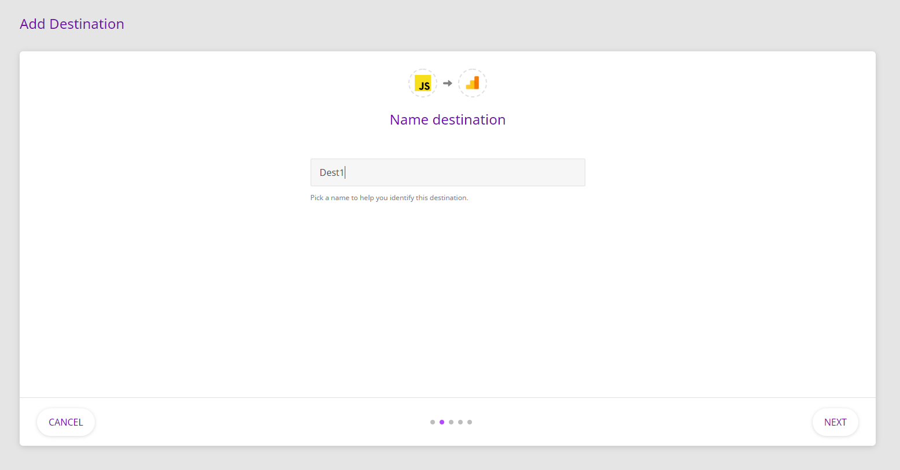
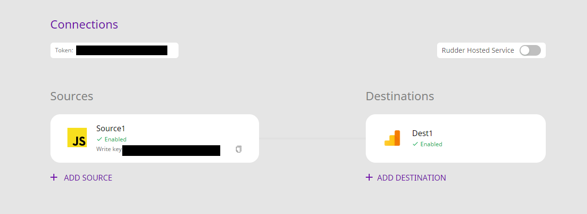

# How to Add a Source and Destination in RudderStack

RudderStack allows you to send your event data from either your website or a mobile device \(Android and iOS\) to a destination platform of your choice. A destination is a platform that uses your event data for analytics. However, in order to so, it is important to correctly add and configure your source and destination on the RudderStack platform.

## Adding a source

To add a source, please follow these steps:

- Log in to the [RudderStack app](https://app.rudderlabs.com/login). Once logged in, your home page should look like the following:

RudderStack Dashboard

- Click on **ADD SOURCE.**
- Choose the source from which you want to collect the event data. We support JavaScript \(web app\), as well as Android and iOS.

The Add Source Menu

- Once you choose the source, please type the name you want to assign to that source.

The Name your source screen

- Once you have added the source, you should see the following screen, with an option to add a destination. That's it, you are good to go!

The Source Details screen

You can note the <strong>write key</strong> and use it to configure the SDK, in order to send the event data from it.

## Adding a destination

Please follow the steps below to add a destination to which you want to send your event data:

Make sure you have added a source before you add a destination.

- Click on the **ADD DESTINATION** option as shown:

The Add Destination option after configuring the source

- Choose the appropriate destination from the list of destinations shown in the following screen and then click on **Next**:

Choosing a destination

- Name your destination. In case you are adding multiple destinations for various sources, ensure that the destination names are unique.

Naming your destination

- The source you have configured initially will automatically appear at this stage. Click on **Next**.
- You will now be required to enter **Tracking ID** associated with the destination. Ideally, you should be able to retrieve this from the admin dashboard of that destination. In case of Google Analytics, as an example, you can retrieve it as shown below:

Google Analytics dashboard for retrieving Tracking ID

- Once you have retrieved Tracking ID, enter it in the **RudderStack Connection Settings** page as shown:

RudderStack Connection Settings

- If you want to transform your source event data, you can select the **Create New Transformation** option. Otherwise, select the **No transformation needed** option to send the event data as is, to the destination. Then, click **Next**.

And that's it! You have successfully added a destination and configured it to receive the event data from your source! Your dashboard should now look like the following:

RudderStack dashboard after adding source and destination

## Contact Us

Have you encountered any issues while configuring your source and destination? Please feel free to [contact us](mailto:%20docs@rudderstack.com) or start a conversation on our [Slack](https://rudderstack.com/join-rudderstack-slack-community) channel, and we will be happy to help you!
