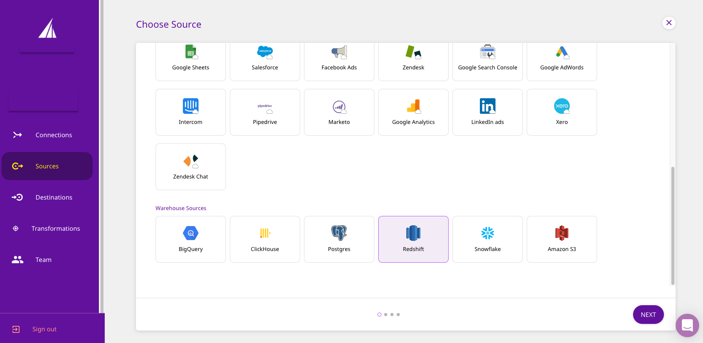
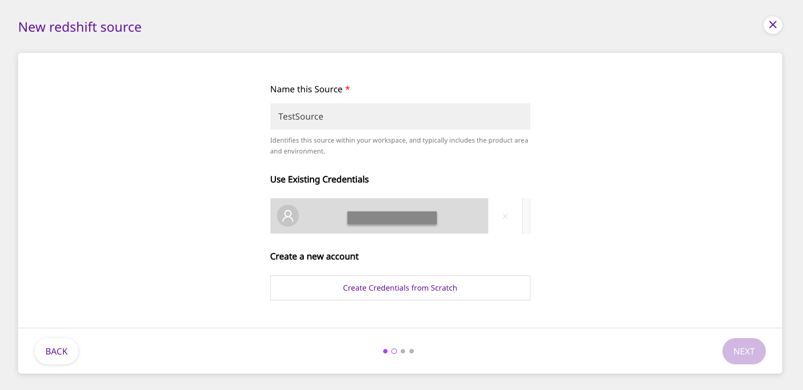
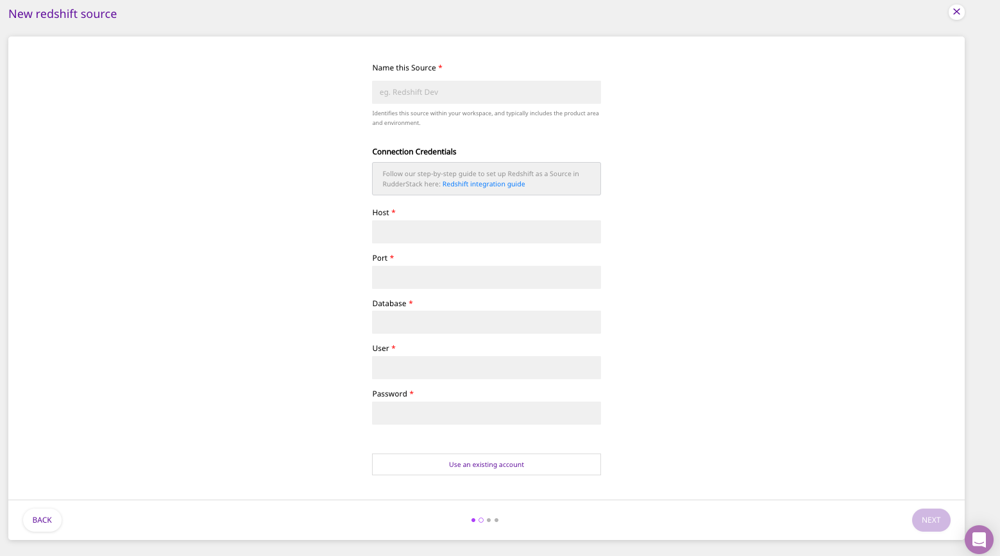
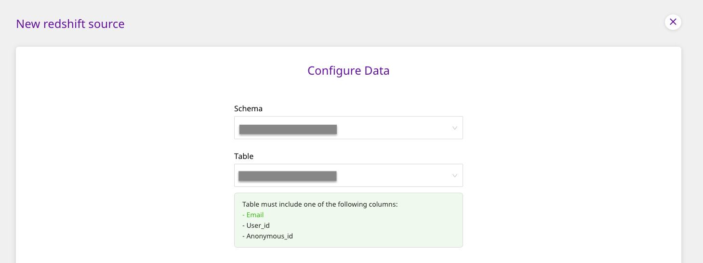
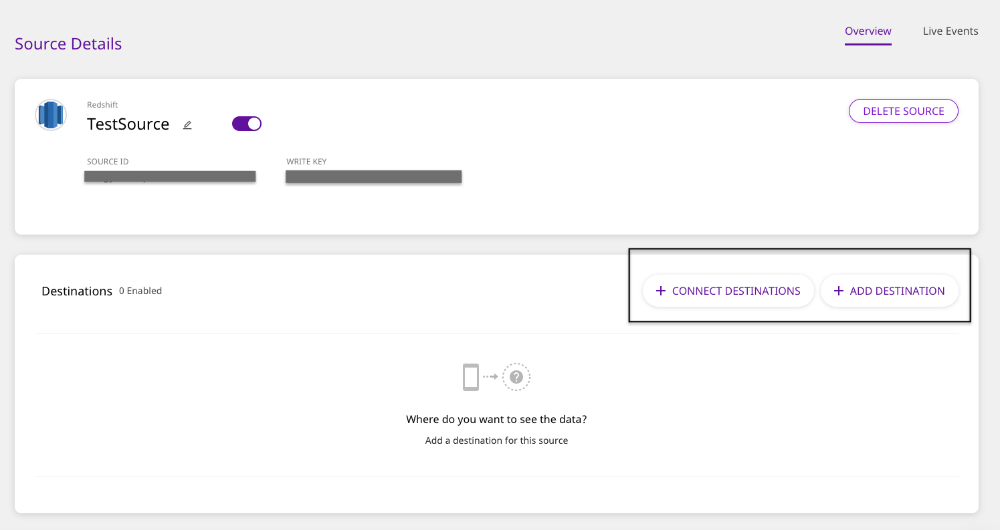

# Amazon Redshift

[Amazon Redshift](https://aws.amazon.com/redshift/) is the world's fastest cloud data warehouse. It allows you to handle large analytical workloads with best-in-class performance, speed, and efficiency. With Redshift, you don't have to worry about the scale of your data or the cost of running queries on them.

This guide will help you configure Redshift as a source from which you can route event data to your desired destinations through RudderStack.

## Granting Permissions

Run the following SQL queries to grant the necessary permissions for warehouse action

```text
CREATE USER RUDDER WITH PASSWORD 'strong_unique_password'
GRANT USAGE ON SCHEMA "testschema" TO RUDDER;
GRANT SELECT ON TABLE "testschema"."testtable" to RUDDER;
GRANT CREATE ON SCHEMA "testschema" to RUDDER;
```

## Set Up as Source

To set up Amazon Redshift as a source in RudderStack, follow these steps:

- Log into your [RudderStack dashboard](https://app.rudderlabs.com/signup?type=freetrial).
- From the left panel, select **Sources**. Then, click on **Add Source**, as shown:


- Scroll down to the **Warehouse Sources** and select **Redshift**. Then, click on **Next**.



### Setting Up the Connection

- Assign a name to your source, and click on **Create Credentials from Scratch**. Then, click on **Next**.



<div class="successBlock">

  If you've already configured Redshift as a source before, your existing
  credentials will automatically appear under
  **Use existing credentials**.
</div>

- Next, enter the relevant connection details in the **Connection Credentials** as shown below:



- The required settings are:
  - **Host -** The host name of your Redshift service.
  - **Database -** The database name in your Redshift instance where the data is loaded.
  - **User** - The username which has the required read/write access to the above database.
  - **Password** - The password for the above user should be specified here.
  - **Port** - The port number of your Redshift service should be specified here.

### Specifying the Data to Import

- Next, select the **Schema** and the **Table** from which you want RudderStack to import the data.



<div class="warningBlock">

Your table must include one of the following columns - <code class="inline-code">email</code>, <code class="inline-code">user_id</code>, or <code class="inline-code">anonymous_id</code>.

</div>

- Once you specify the table containing the required columns, you will be able to preview a snippet of your data, as shown below:


- Here, you can select all or only a few specific columns of your choice, search the columns by a keyword, and also edit the **JSON Trait Key**, as shown below. You can also preview the resultant JSON on the right. Once you've select the required table columns to import the data from, click on **Next**.


### Setting the Data Update Schedule

- Next, you will be required to set the **Run Frequency** to schedule the data import from your Redshift instance to RudderStack. You can also specify the time when you want this synchronization to start, by choosing the time under the **Sync Starting At** option. Then, click on **Next**.


That's it! Redshift is now successfully configured as a source on your RudderStack dashboard.

RudderStack will start importing data from your Redshift instance as per the specified frequency. You can further connect this source to your preferred destination by clicking on **Connect Destinations** or **Add Destinations**, as shown:



<div class="infoBlock">

If you have already configured a destination on the RudderStack platform, choose the **Connect Destinations** option. To add a new destination from scratch, you can select the **Add Destination** option.

</div>

## Contact Us

If you come across any issues while configuring Amazon Redshift as a source on the RudderStack dashboard, please feel free to [contact us](mailto:%20docs@rudderstack.com). You can also start a conversation on our [Slack](https://rudderstack.com/join-rudderstack-slack-community) channel; we will be happy to talk to you!
