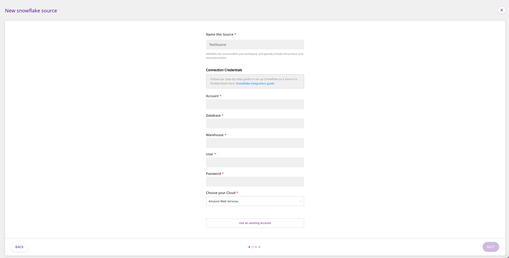
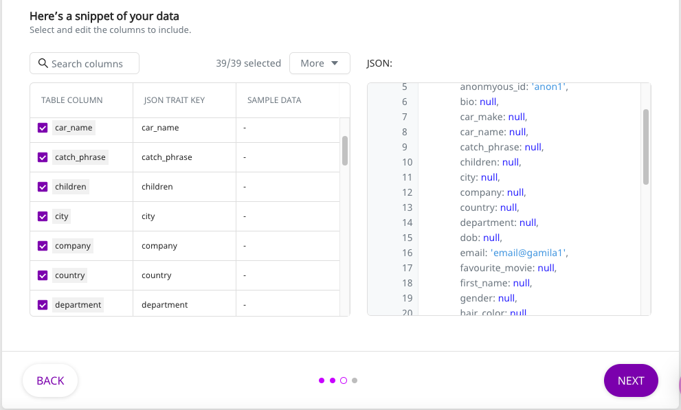

# Snowflake

[Snowflake](https://www.snowflake.com/) is a cloud-based data warehouse provided as Software-as-a-Service \(SaaS\). It offers all the features of a modern data warehouse, including scalability, ease of use, secure access to your data, accelerated analytics capabilities, and much more.

This guide will help you configure Snowflake as a source from which you can route event data to your desired destinations through RudderStack.

## Granting Permissions

Run the following SQL queries to grant the necessary permissions for warehouse action

```text
CREATE ROLE RUDDER_ROLE;
SHOW ROLES;
CREATE OR REPLACE USER RUDDER PASSWORD = 'strong_unique_password' DEFAULT_ROLE = 'RUDDER_ROLE';
SHOW USERS;
GRANT ROLE RUDDER_ROLE TO USER RUDDER;
GRANT USAGE ON WAREHOUSE TESTWAREHOUSE TO ROLE RUDDER_ROLE;
GRANT USAGE ON DATABASE TESTDATABASE TO ROLE RUDDER_ROLE;
GRANT USAGE ON SCHEMA TESTDATABASE.TESTSCHEMA TO ROLE RUDDER_ROLE;
GRANT CREATE TABLE ON SCHEMA TESTDATABASE.TESTSCHEMA TO ROLE RUDDER_ROLE;
GRANT SELECT ON TABLE TESTDATABASE.TESTSCHEMA.TESTTABLE TO ROLE RUDDER_ROLE;
```

## Set Up as Source

To set up Snowflake as a source in RudderStack, follow these steps:

- Log into your [RudderStack dashboard](https://app.rudderlabs.com/signup?type=freetrial).
- From the left panel, select **Sources**. Then, click on **Add Source**, as shown:


- Scroll down to the **Warehouse Sources** and select **Snowflake**. Then, click on **Next**.


### Setting Up the Connection

- Assign a name to your source, and click on **Create Credentials from Scratch**. Then, click on **Next**.

<div class="successBlock">

  If you've already configured Snowflake as a source before, your existing
  credentials will automatically appear under{" "}
  <strong>Use existing credentials</strong>.
</div>

- Next, enter the relevant connection details in the **Connection Credentials** as shown below:



- The required settings are:

  - **Account -** This is the account ID of your warehouse. The account ID is part of the Snowflake URL. The following examples illustrate the slight differences in the account ID for various cloud providers**.**

    | Account ID sample           | Snowflake URL                                                    | Snowflake cloud provider                                        |
    | :-------------------------- | :--------------------------------------------------------------- | :-------------------------------------------------------------- |
    | **qya56091.us-east-1**      | `https://`**`qya56091.us-east-1`**`.snowflakecomputing.com`      | Amazon Web Services \(AWS\)                                     |
    | **rx18795.east-us-2.azure** | `https://`**`rx18795.east-us-2.azure`**`.snowflakecomputing.com` | Microsoft Azure \(Azure[\)](https://azure.microsoft.com/en-us/) |
    | **ah76025.us-central1.gcp** | `https://`**`ah76025.us-central1.gcp`**`.snowflakecomputing.com` | Google Cloud Platform \(GCP\)                                   |

  - **Database -** The name of the database in which your data resides goes here.
  - **Warehouse** - Specify the name of the warehouse here.
  - **User** - The username which has the required read/write access to the above database.
  - **Password** - The password for the above user should be specified here.
  - **Your Cloud** - Please specify the cloud service in this field.

### Specifying the Data to Import

- Next, select the **Schema** and the **Table** from which you want RudderStack to import the data.


<div class="warningBlock">

Your table must include one of the following columns - <code class="inline-code">email</code>, <code class="inline-code">user_id</code>, or <code class="inline-code">anonymous_id</code>.

</div>

- Once you specify the table containing the required columns, you will be able to preview a snippet of your data, as shown below:



- Here, you can select all or only a few specific columns of your choice, search the columns by a keyword, and also edit the **JSON Trait Key**, as shown below. You can also preview the resultant JSON on the right. Once you've select the required table columns to import the data from, click on **Next**.


### Setting the Data Update Schedule

- Next, you will be required to set the **Run Frequency** to schedule the data import from your Snowflake instance to RudderStack. You can also specify the time when you want this synchronization to start, by choosing the time under the **Sync Starting At** option. Then, click on **Next**.


That's it! Snowflake is now successfully configured as a source on your RudderStack dashboard.

RudderStack will start importing data from your Snowflake instance as per the specified frequency. You can further connect this source to your preferred destination by clicking on **Connect Destinations** or **Add Destinations**, as shown:


<div class="infoBlock">

If you have already configured a destination on the RudderStack platform, choose the <strong>Connect Destinations</strong> option. To add a new destination from scratch, you can select the <strong>Add Destination</strong> option.

</div>

## Contact Us

If you come across any issues while configuring Snowflake as a source on the RudderStack dashboard, please feel free to [contact us](mailto:%20docs@rudderstack.com). You can also start a conversation on our [Slack](https://rudderstack.com/join-rudderstack-slack-community) channel; we will be happy to talk to you!
